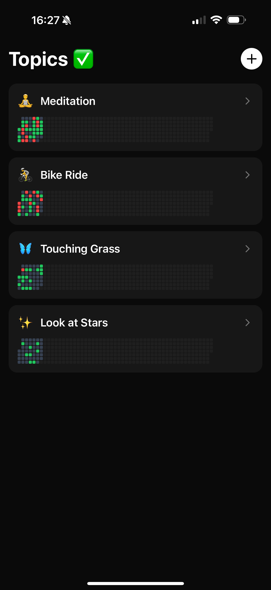
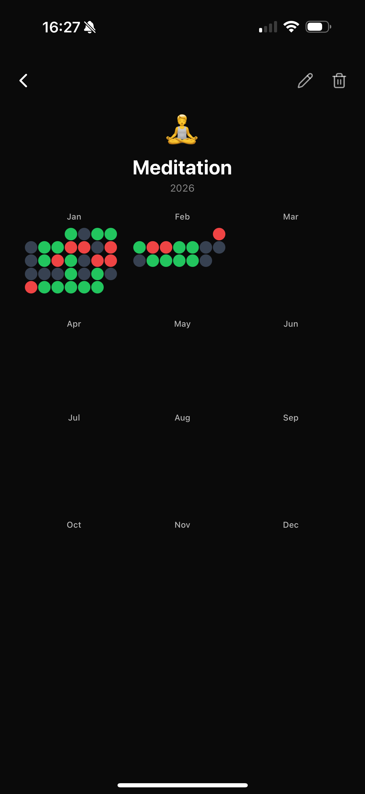
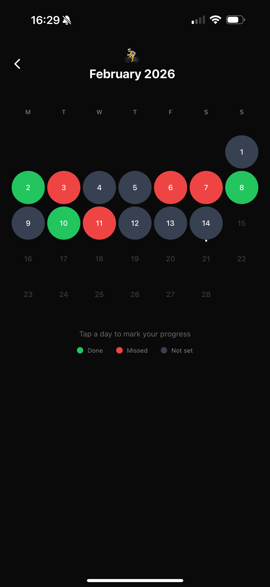
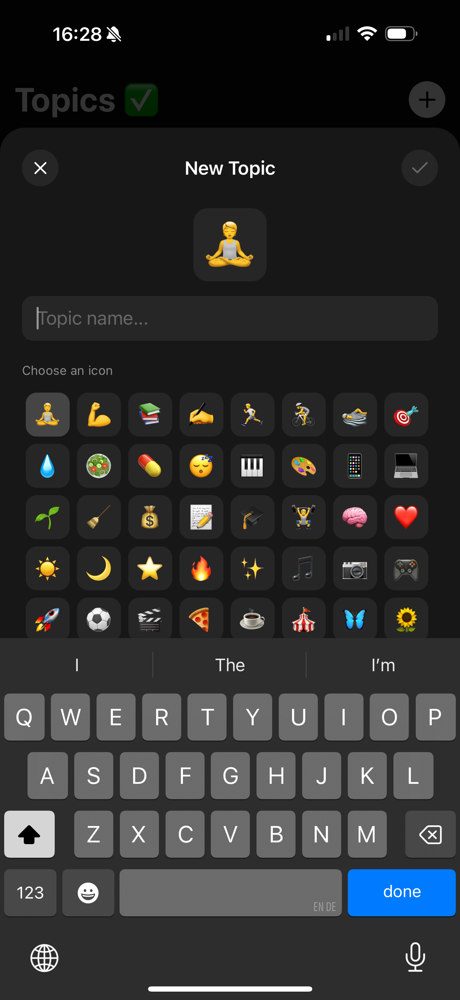

# Mudo - Minimalist Habit & Activity Tracker

Mudo is a clean, simple, and privacy-focused habit tracker designed to help you visualize your consistency. Inspired by contribution heatmaps, it gives you a clear overview of your progress across different topics.

## ✨ Features
- **Create Custom Topics:** Choose from a variety of icons to personalize your tracking.
- **Visual Progress:** See your year at a glance with an intuitive dot-grid view.
- **Simple Logging:** Mark days as "Done" or "Missed" with a single tap.
- **Privacy First:** Your data stays on your device.

## 📸 Screenshots

  
  
  
  

## 🛠 Usage & Support
If you have any questions, encounter a bug, or want to suggest a feature, please feel free to:
- **Open an Issue:** Use the [Issues](https://github.com/agentfortytwo/mudo/issues) tab above.
- **Contact via Email:** agentfortytwo@icloud.com

## 🔒 Privacy Policy
Your privacy is important. Mudo does not collect, store, or share any personal data. All tracking data is stored locally on your iPhone.
You can find the full policy here: [Privacy Policy](PRIVACY.md)

---
*Developed with ❤️ by [Dein Name/Nutzername]*
